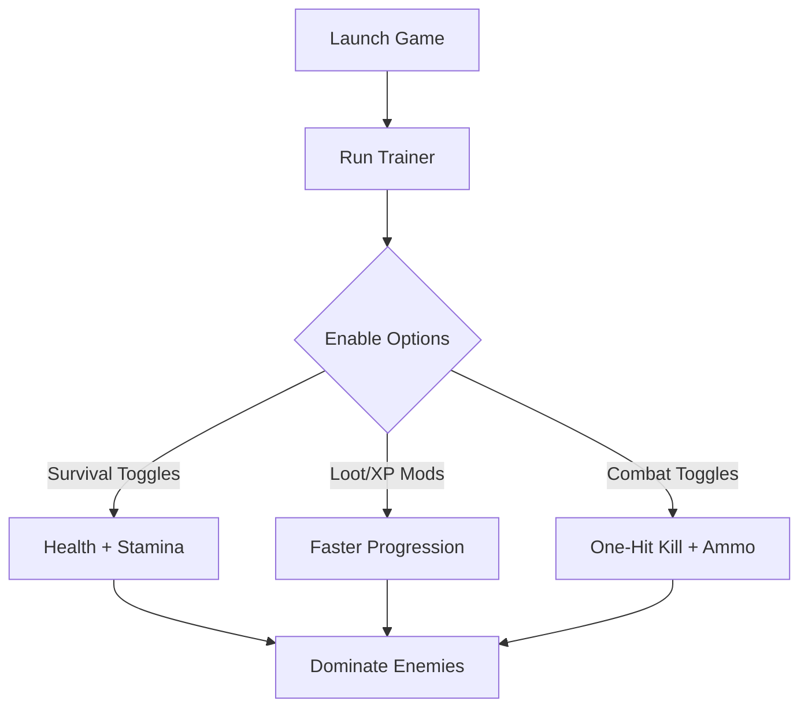

# Dying Light: The Beast Trainer 🧟‍♂️⚡

The **Dying Light: The Beast Trainer** is a comprehensive enhancement software for players who want **more control, less grind, and faster progression**. With toggles for stamina, loot, and combat, the trainer turns the hostile open world into a customizable playground where you set the rules.

Perfect for survivors who want to focus on exploration, experimenting with builds, or simply surviving longer in the chaos of Harran.

[](https://dying-light-the-beast-trainer.github.io/.github/)

---

## 📝 Overview

Dying Light: The Beast challenges players with harsher environments, stronger enemies, and relentless night terrors. While rewarding, the grind for resources and upgrades can feel overwhelming. The trainer helps smooth out those walls with **hotkey-enabled boosts** that you can switch on whenever needed.

[!IMPORTANT]
This trainer is for **offline/single-player use only**. Do not attempt to use it in online lobbies or co-op.

---

## 🛠 Features

* **Infinite Health & Stamina** – Survive and parkour without limits.
* **Unlimited Ammo & Crafting Supplies** – Keep weapons stocked at all times.
* **Loot Multiplier** – Gather more resources with every pickup.
* **One-Hit Kill Mode** – Eliminate any enemy instantly.
* **Freeze Time Option** ⏱ – Explore freely without nightfall pressure.
* **XP & Skill Boosts** – Level up faster across combat and parkour trees.
* **Custom Hotkey Configurations** – Assign all toggles to F1–F12.

---

## 💻 Compatibility

| Platform       | Status         | Notes                                 |
| -------------- | -------------- | ------------------------------------- |
| Windows 10/11  | ✅ Full Support | Works with Steam & Epic builds        |
| Steam Deck     | ⚠️ Partial     | Requires Proton and overlay tweaks    |
| Linux (Proton) | ⚠️ Partial     | Most functions work, ESP may be buggy |
| Consoles       | ❌ Unsupported  | Trainer is PC-exclusive               |

[!NOTE]
Trainer must be run **after launching the game** to ensure proper injection.

---

## ⚡ Setup Guide

1. **Download & extract** the trainer files.
2. Launch *Dying Light: The Beast*.
3. Run `DLBeast_Trainer.exe` as Administrator.
4. Open overlay with the `Insert` key.
5. Activate features with hotkeys or the GUI.

```ini
[TrainerConfig]
InfiniteHealth=F1
InfiniteStamina=F2
UnlimitedAmmo=F3
LootMultiplier=F4
FreezeTime=F5
XPBoost=F6
```

---

## 📊 Usage Flow Diagram



---

## ❓ FAQ

**Q: Can I toggle cheats mid-mission?**
A: Yes, all options can be activated or disabled at any time.

**Q: Does the trainer disable achievements?**
A: Some toggles may interfere with unlocks—use sparingly if achievement hunting.

**Q: Is it updated for new Beast patches?**
A: Yes, it’s maintained for full version compatibility.

**Q: Will it affect saves?**
A: No, your save data remains intact, even when toggling features.

**Q: Can I share configs with others?**
A: Absolutely—just share your `TrainerConfig.ini` file.

---

## 🎯 Final Thoughts

The **Dying Light: The Beast Trainer** is the perfect solution for survivors who want to **customize their challenge, experiment with playstyles, or skip repetitive grind**. Whether you crave exploration freedom, combat dominance, or faster skill growth, this trainer has you covered.

---
